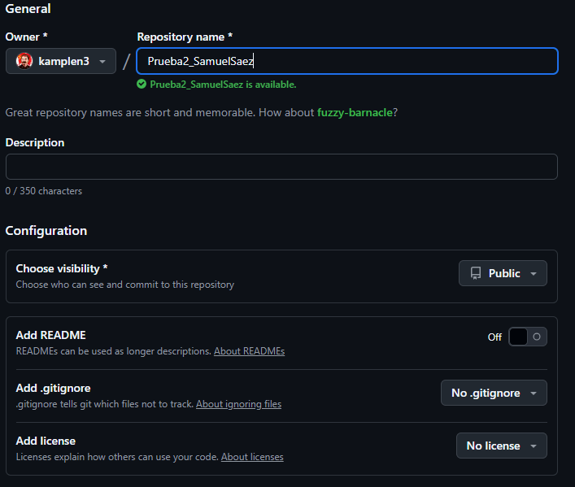
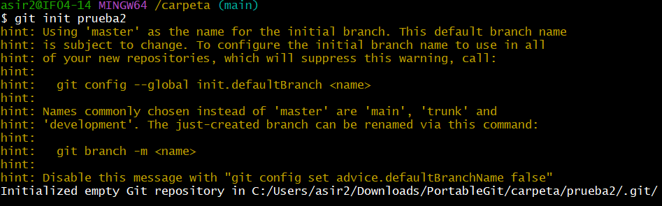
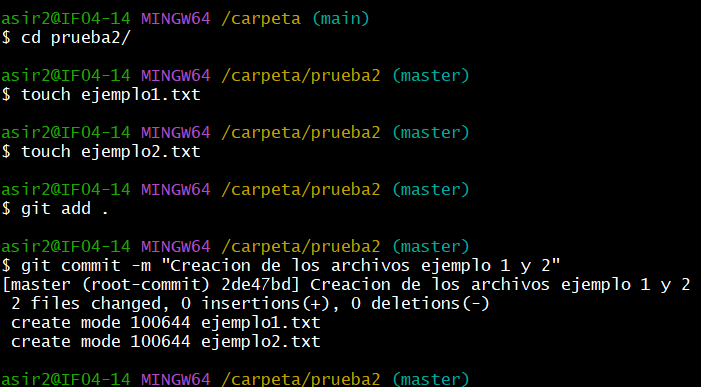
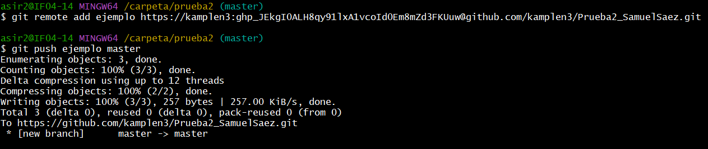
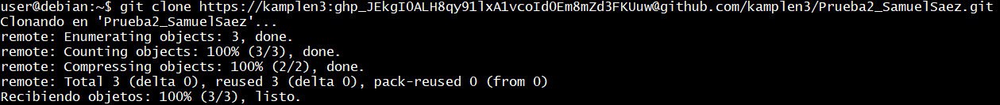
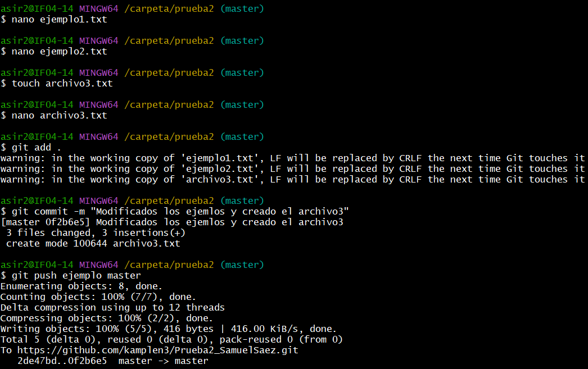
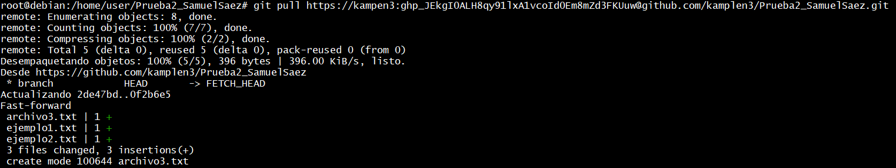

# Ejercicio 1
## Creamos el repositorio

Para crear el repositorio tenemos que entrar en Github desde donde tenemos que crearlo.

## Creamos el repositorio local

Para crear el repositorio en local tenemos que usar el Git Bash y usar el comando `Git init (nombre)`

## Creacion de los archivos

Para crear los archivos primero tenemos que dirigirnos a la carpeta que hemos creado mediante `cd` y dentro crear los archivos con `touch (nombre).txt`.
Para aplicar los cambios los tenemos que añadir al workspace con `git add .` y efectuar los cambios con `git commit -m "(comentario)"`

Añadimos el repositorio con sus credenciales y subimos los atchivos creados

En debian tenemos que conseguir los archivos que hemos subido desde debian.
Para eso necesitamos hacer un `git clone (enlace)`

Ahora modificamos los archivos y creamos uno nuevo. Volvemos a subirlo a GitHub con `git push`

Por último para actualizar el contenido en debian tenemos que usar `git pull` para bajar los archivos actualizados

