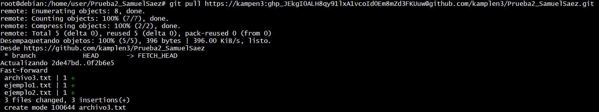
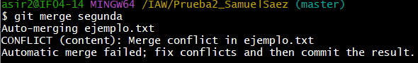
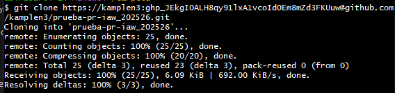

# EJERCICIO3 
## SAMUEL SÁEZ

Primero creamos la rama usando `git branch (nombre de la rama)` y se comprueba mediante el uso de `git branch`.

Ahora nos tenemos que cambiar de rama mediante `git checkout (rama)` y creamos un nuevo archivo.

Para confirma la creación tenemos que usar `git add` y `git commit`.

Para hacer el merge tenemos que volver a la rama principal y hacer `git merge (rama)`, no debiría dar errores debido a que no hay dos archivos iguales con diferente contenido.

Para borrar la rama tenemos que usar `git branch -d (rama)`

Ahora volvemos a crear otra rama y modificamos el archivo dentro de esa rama.

Para generar un conflicto modificamos el archivo tambien en la rama principal con distinto contenido y hacemos `git merge`

Para resolver el conflicto tenemos que modificar el archivo y dejar el texto que queramos.

Volvemos a hacer `git add` y `git commit` y debería resolver el conflicto.

Vemos que al hacer otro merge no genera ningún conflicto.

Aqui vemos que están creadas las ramas.

