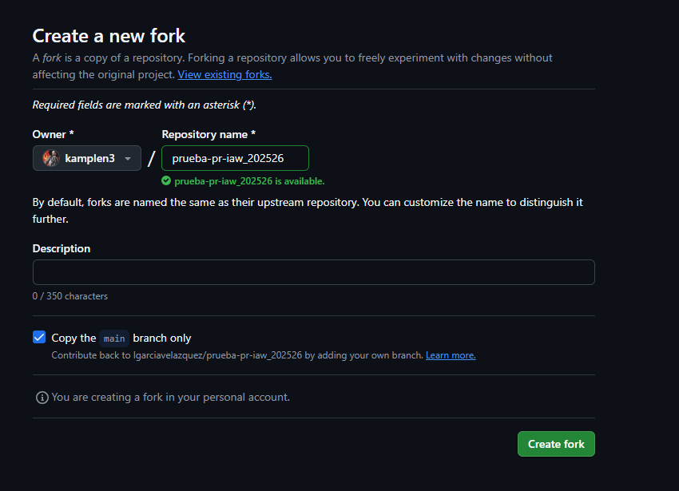

# EJERCICIO 4
## SAMUEL SÁEZ

Primero tenemos que entrar en su repositorio y crear un fork con la opción encontrada arriba a la derecha.

Después creamos un clon del repositorio que se crea al hacer el fork.

Ahora tenemos que cambiar el fichero README y añadir un enlace al fichero MarkDown

Ahora creamos el fichero MarkDown en el enlace anterior usando `nano (nombre)`

Añadimos los cambios y hacemos el commit con `git add .` `git commit -m "comentario"`

Subimos los cambios realizados usando `git push`

Al acabar tenemos que solicitar un pull request para unir el contenido al contenido principal.

